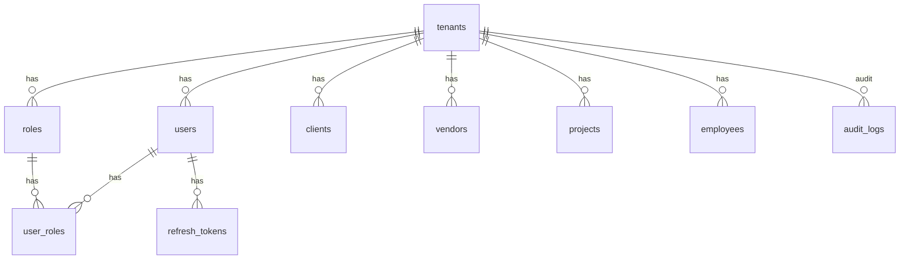
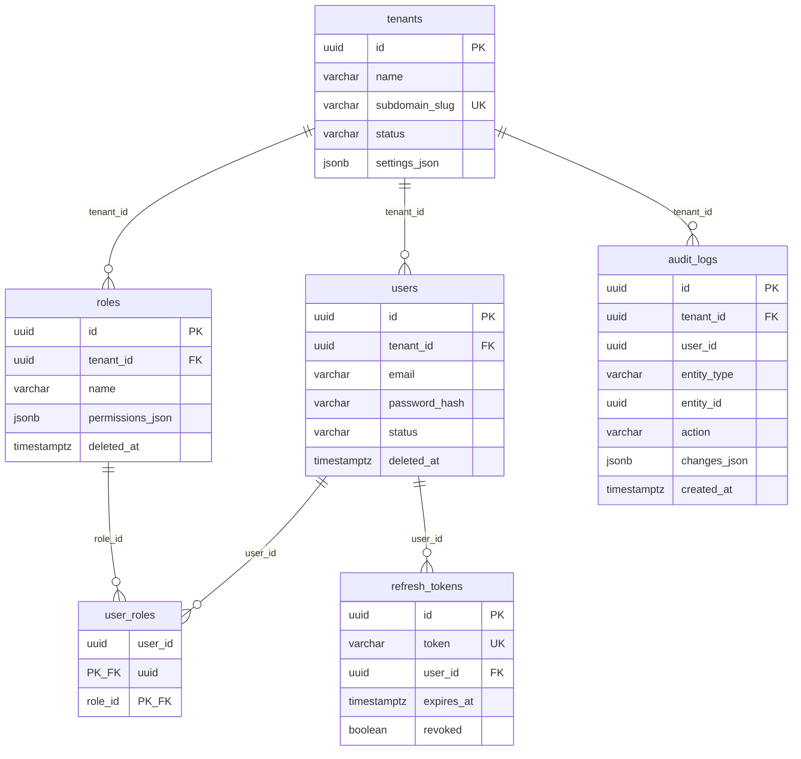
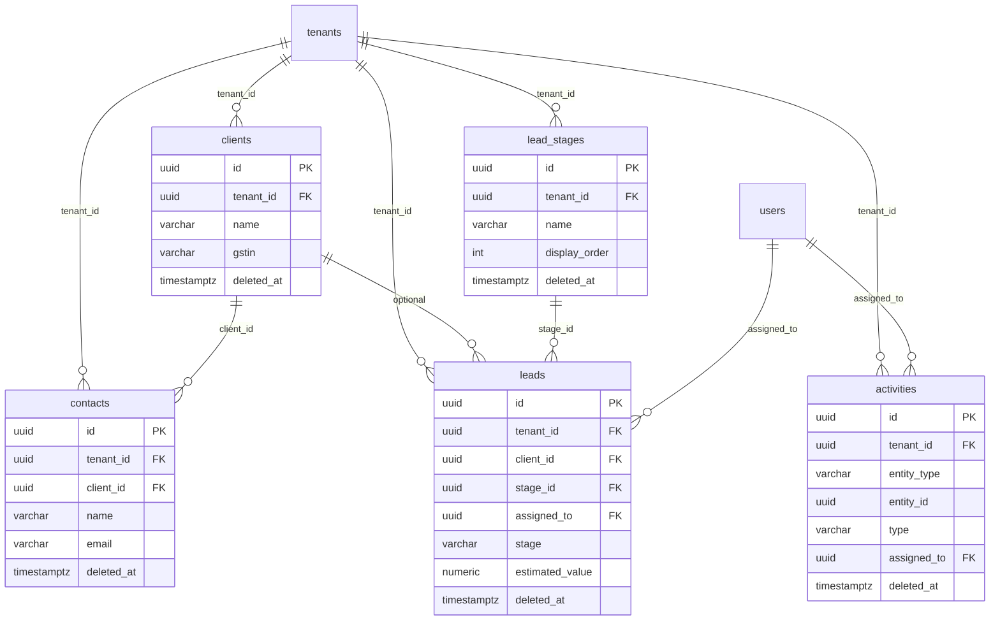
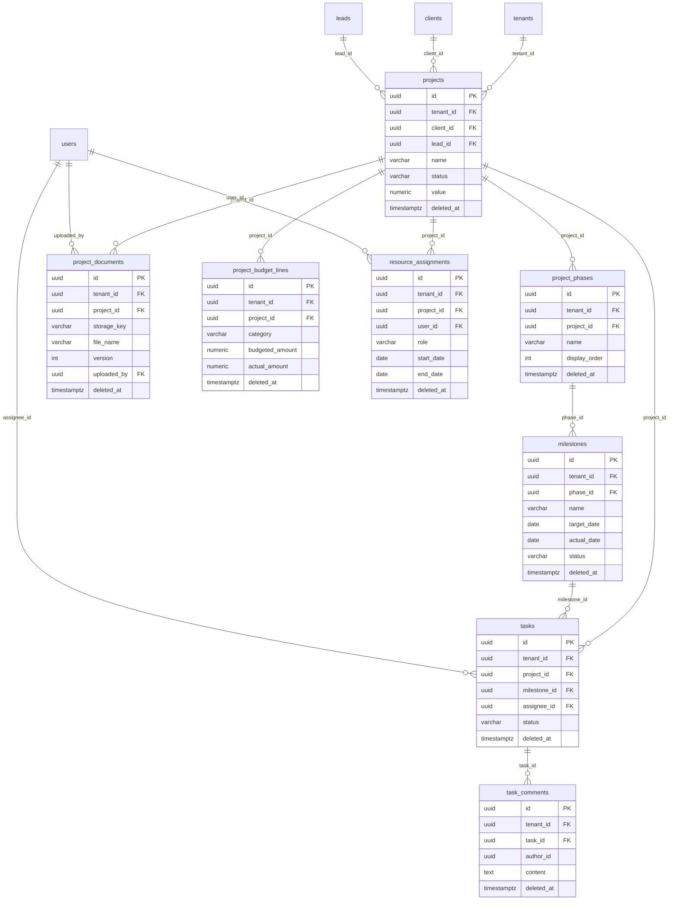
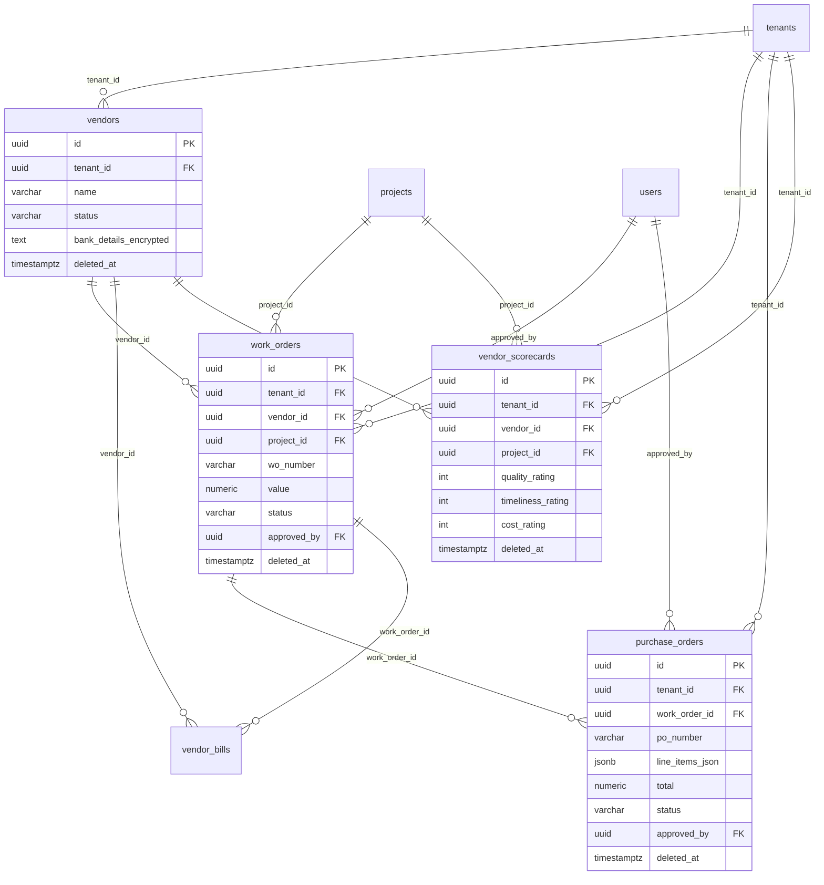
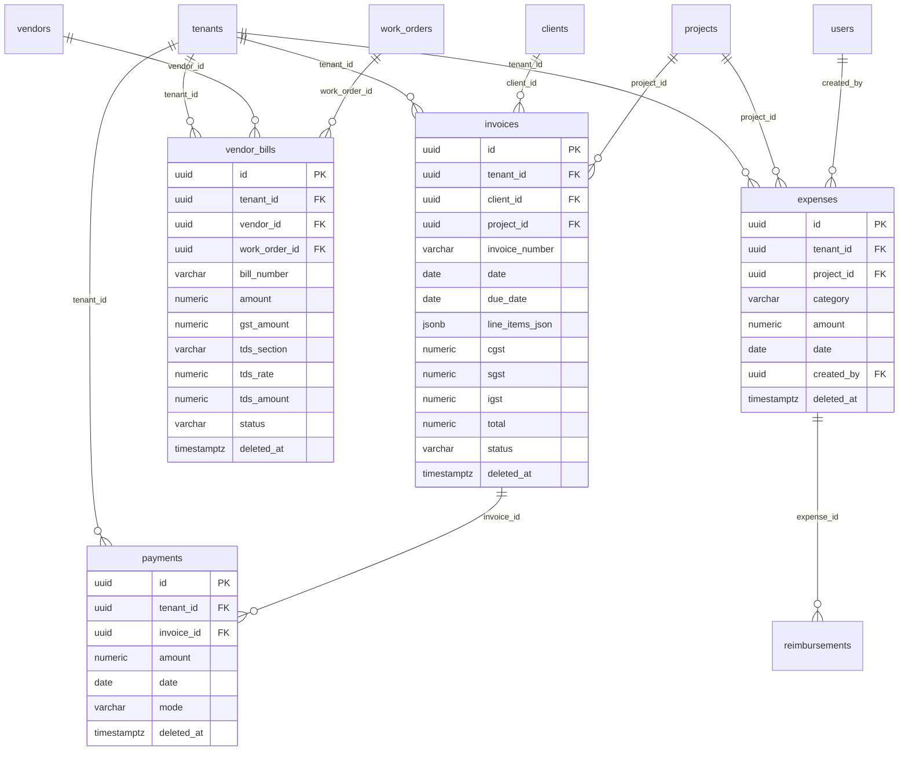
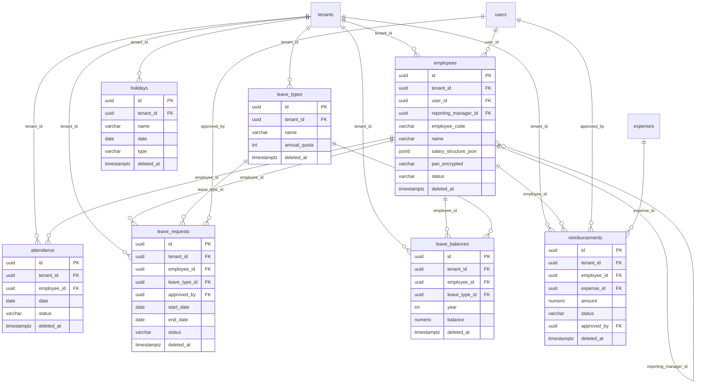

# ArqOps — Database ER Diagram

This document reflects the **PostgreSQL schema** defined by Flyway migrations in [`backend/src/main/resources/db/migration`](backend/src/main/resources/db/migration). All tenant-scoped tables include `tenant_id` referencing `tenants(id)` (shown explicitly below).

**Conventions**

- **PK:** Primary key (`id`, UUID).
- **Soft delete:** `deleted_at` on most business tables (filtered in the application layer).
- **Platform table:** `tenants` has no `tenant_id`.

---

## 1. High-level: tenant hub

Every business domain hangs off `tenants`. `users` is the primary actor table for assignments and approvals.

---

## 2. IAM & platform

---

## 3. CRM

---

## 4. Projects (structure, tasks, documents, budget, resources)

---

## 5. Vendors, work orders, POs, scorecards

`work_orders.project_id` and `vendor_scorecards.project_id` reference `projects` (added in migration V5).

---

## 6. Finance (invoices, payments, vendor bills, expenses)

---

## 7. HR

---

## 8. Cross-domain links (reference)

| From | To | Purpose |
|------|-----|---------|
| `projects` | `clients`, `leads` | Project origin from CRM |
| `work_orders` | `projects`, `vendors` | Vendor work on a site |
| `invoices` | `clients`, `projects` | Billing |
| `expenses` | `projects`, `users` | Cost and overhead |
| `reimbursements` | `expenses` | Approved reimbursement → finance expense (V16) |
| `employees` | `users` | Link HR record to login |
| `employees` | `employees` | Reporting hierarchy |

---

## 9. Entity count

| Area | Tables |
|------|--------|
| Platform / IAM | `tenants`, `roles`, `users`, `user_roles`, `refresh_tokens`, `audit_logs` |
| CRM | `clients`, `contacts`, `lead_stages`, `leads`, `activities` |
| Vendor | `vendors`, `work_orders`, `purchase_orders`, `vendor_scorecards` |
| Project | `projects`, `project_phases`, `milestones`, `tasks`, `task_comments`, `project_documents`, `project_budget_lines`, `resource_assignments` |
| Finance | `invoices`, `payments`, `vendor_bills`, `expenses` |
| HR | `employees`, `attendance`, `leave_types`, `leave_requests`, `leave_balances`, `holidays`, `reimbursements` |

**Total: 32 tables** (including `task_comments` and columns added in V16+).

---

*Render Mermaid diagrams in GitHub, GitLab, VS Code (Mermaid Preview), or export to PNG/SVG using [mermaid-cli](https://github.com/mermaid-js/mermaid-cli) if needed.*
