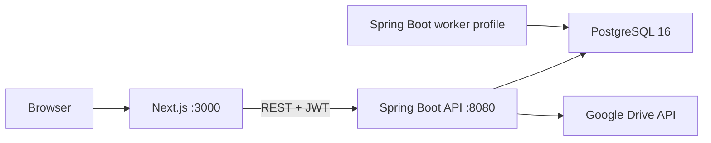

# ArqOps — Low-Level Design (Implementation)

**Version:** 1.2  
**Scope:** This document describes the *as-built* implementation of the ArqOps modular monolith: backend (Spring Boot 3.3, Java 21), frontend (Next.js App Router, TypeScript), persistence, and cross-cutting concerns. It complements [BRD.md](BRD.md) and [TECHNICAL_ARCHITECTURE.md](TECHNICAL_ARCHITECTURE.md).

**Audience:** Engineers extending features, reviewing security boundaries, or onboarding to the codebase.

---

## 1. Deployment and runtime topology



| Process | Role |
|--------|------|
| **Frontend** | Next.js dev server or production build; calls backend over HTTP; tenant app JWT in `localStorage`; platform admin uses separate keys and [`platformApi`](frontend/src/lib/platform/platform-api.ts). |
| **Backend** | REST API, JPA, security filter chain, Flyway migrations on startup. **No Redis** in this stack—dashboard and reports read PostgreSQL directly. |
| **Worker** | Same JAR, `spring.profiles.active=worker`, `web-application-type: none`. Intended for async jobs; **no dedicated worker package** in source yet—profile is a placeholder for future background processing. |
| **PostgreSQL** | Single schema; tenant-owned tables carry `tenant_id`; platform admin tables have no `tenant_id`. |
| **Google Drive** | Per-tenant OAuth (`drive.file`); resumable upload sessions; streaming download via backend using refresh token (encrypted on `tenants`). |

---

## 2. Backend structure

### 2.1 Package map (`com.arqops`)

| Package | Responsibility |
|---------|----------------|
| `common` | Shared infrastructure: DTOs (`ApiResponse`), security (`SecurityConfig`, `JwtTokenProvider`, `JwtAuthenticationFilter`, `Permissions`, `UserPrincipal`), tenancy (`TenantContext`, `TenantAwareEntity`, `AuditableEntity`, `TenantHibernateFilter`), audit (`AuditService`, `AuditLog`, `AuditController`), encryption (`EncryptionService`), storage (`GoogleDriveStorageService`, `FileController`, `google/*` HTTP helpers), config (`GoogleDriveProperties`), exception handling, validation. |
| `iam` | Tenants, users, roles, tenant authentication (`AuthService`, `AuthController`), tenant user/role APIs (`UserService`, `TenantController`), **Google Drive connect** (`TenantGoogleDriveService`, `TenantGoogleDriveController`). **Platform admin:** `PlatformUser` / `PlatformRefreshToken`, `PlatformAuthService`, `PlatformAuthController`, `PlatformTenantService`, `PlatformTenantController` (cross-tenant tenant lifecycle; JWT without `tenant_id`). |
| `crm` | Clients, contacts, leads, activities, lead stages, pipeline. |
| `vendor` | Vendors, work orders, purchase orders, vendor bills linkage, scorecards. |
| `project` | Projects, phases, milestones, tasks, task comments, resource assignments, budget lines, project documents. |
| `finance` | Invoices, payments, expenses, vendor bills (finance-side). |
| `hr` | Employees (optional `user_id` link to IAM `users`), attendance, leave types/requests/balances, holidays, reimbursements. |
| `report` | `DashboardService`, `ReportService` (native SQL via `EntityManager`), `ReportController`. |

**Approximate size:** ~200+ Java source files under `com.arqops`.

### 2.2 Layering convention

For each bounded context the pattern is:

```
Controller  →  Service  →  Repository (Spring Data JPA)
     ↓              ↓
ApiResponse<T>   DTOs (Request/Response)
     @PreAuthorize("hasAuthority('module.action')") on controllers
```

- **Controllers** live under `*.controller`, map to `/api/v1/...`, return `ResponseEntity<ApiResponse<T>>`.
- **Services** encapsulate business rules, call repositories, invoke `AuditService` and `EncryptionService` where applicable.
- **Repositories** extend `JpaRepository<Entity, UUID>` under `*.repository`.

Pagination uses Spring `Pageable` where implemented; list endpoints often return `Page<T>` wrapped in `ApiResponse` with `PageMeta`.

### 2.3 Standard API envelope

Defined in [`backend/src/main/java/com/arqops/common/dto/ApiResponse.java`](backend/src/main/java/com/arqops/common/dto/ApiResponse.java):

- **Success:** `{ "data": T, "meta": { page, size, totalElements, totalPages } }` (meta optional).
- **Error:** `{ "error": { "code", "message", "details" } }`.

Jackson is configured with `non_null` inclusion and IST (`Asia/Kolkata`) for date/time.

### 2.4 Authentication and authorization

| Mechanism | Implementation |
|-----------|----------------|
| **Password hashing** | `BCryptPasswordEncoder` with strength **12** ([`SecurityConfig`](backend/src/main/java/com/arqops/common/security/SecurityConfig.java)). |
| **Tenant JWT** | HS512; access + refresh tokens; claims include `userId`, `tenantId`, `email`, `roles`, `permissions` ([`JwtTokenProvider`](backend/src/main/java/com/arqops/common/security/JwtTokenProvider.java)). |
| **Platform JWT** | Separate token path: claim `platform: true`, no `tenant_id`; principal gets `ROLE_PLATFORM_ADMIN`. Used only for `/api/v1/platform/**` (except public auth endpoints). |
| **Request path** | `JwtAuthenticationFilter` extracts `Bearer` token, validates, builds `UsernamePasswordAuthenticationToken` with `UserPrincipal` and authorities. Platform tokens clear tenant context and skip tenant-scoped user resolution. |
| **Tenant context** | On successful **tenant** JWT parse, `TenantContext.setCurrentTenantId(tenantId)`; cleared in `finally` after the filter chain. |
| **RBAC** | Method security enabled (`@EnableMethodSecurity`). Tenant APIs use `@PreAuthorize("hasAuthority('...')")` or `hasRole('TENANT_ADMIN')`. Platform tenant APIs use `@PreAuthorize("hasRole('PLATFORM_ADMIN')")`. Canonical permission strings are in [`Permissions.java`](backend/src/main/java/com/arqops/common/security/Permissions.java). **TENANT_ADMIN** receives all permissions from `Permissions.ALL` at authentication time. |
| **Public routes** | `/api/v1/auth/**`, `/api/v1/platform/auth/**`, `GET /api/v1/tenant/storage/google/callback`, `POST /api/v1/tenant`, actuator health, Swagger, `OPTIONS /**`. |
| **403 vs 401** | `accessDeniedHandler` returns JSON `FORBIDDEN` for authorized-but-denied requests; unauthenticated requests still get `UNAUTHORIZED`. |

**CORS:** Allowed origins from `app.cors.allowed-origins`; headers include `Authorization`, `Content-Type`, `X-Tenant-Id`.

### 2.5 Multi-tenancy (application layer)

| Component | Behavior |
|-----------|----------|
| **`TenantAwareEntity`** | Extends `AuditableEntity`; adds non-null `tenant_id` (immutable after insert). `@PrePersist` sets `tenantId` from `TenantContext` if null. |
| **`AuditableEntity`** | `id` (UUID), `createdAt`, `updatedAt`, `deletedAt` for soft delete. |
| **`@SQLRestriction("deleted_at IS NULL")`** | Applied on entities to hide soft-deleted rows from Hibernate loads. |
| **Hibernate tenant filter** | `@FilterDef` / `@Filter` on `TenantAwareEntity`: `tenant_id = :tenantId`. |
| **`TenantHibernateFilter`** | Aspect: `@Before` most `com.arqops..repository.*Repository.*(..)` — enables `tenantFilter` with `TenantContext`’s tenant ID on the Hibernate `Session`. **Excluded** repository types (no filter / or explicit disable when tenant context is null): `PlatformUserRepository`, `PlatformRefreshTokenRepository`, `RefreshTokenRepository`, `TenantRepository`. When `TenantContext` has no tenant ID, the aspect **disables** `tenantFilter` so pooled connections do not leak a stale tenant predicate. |
| **Native SQL reports** | `ReportService` / `DashboardService` use explicit `WHERE tenant_id = :tid` in queries (filters do not apply to arbitrary native SQL). |

**Note:** PostgreSQL Row-Level Security (RLS) is described in the BRD as defense-in-depth; **this codebase relies on application-level scoping + Hibernate filter + explicit SQL**, not RLS policies in migrations.

### 2.6 Sensitive data

| Concern | Implementation |
|---------|------------------|
| **PAN / bank strings** | [`EncryptionService`](backend/src/main/java/com/arqops/common/encryption/EncryptionService.java) — AES-GCM; key from `app.encryption.key` (32-byte expectation for AES-256). Used in vendor and employee flows where implemented. |
| **Files** | [`GoogleDriveStorageService`](backend/src/main/java/com/arqops/common/storage/google/GoogleDriveStorageService.java) + [`FileController`](backend/src/main/java/com/arqops/common/storage/FileController.java): `POST /api/v1/files/upload-session`, `GET /api/v1/files/{fileId}/download` (stream). Tenant OAuth state via signed JWT in [`JwtTokenProvider`](backend/src/main/java/com/arqops/common/security/JwtTokenProvider.java). |

### 2.7 Audit trail

[`AuditService`](backend/src/main/java/com/arqops/common/audit/AuditService.java) writes `AuditLog` rows (tenant, user, entity type/id, action, JSON changes, IP). Invoked from services on CUD where wired. [`AuditController`](backend/src/main/java/com/arqops/common/audit/AuditController.java) exposes read APIs for tenant admins.

**Caveat:** `@Async` audit logging uses `TenantContext`/`SecurityContext` — behavior under async boundaries should be verified for production hardening.

### 2.8 Persistence and schema evolution

- **ORM:** Hibernate; `ddl-auto: validate` — schema must match entities.
- **Migrations:** Flyway scripts in [`backend/src/main/resources/db/migration`](backend/src/main/resources/db/migration) (`V1`–`V18`): platform/tenant tables, IAM, CRM, vendor, project, finance, HR, seeds, RBAC updates, gap enhancements (e.g. `task_comments`, employee emergency fields, reimbursement `expense_id`). **`V17__platform_admin.sql`:** `platform_users`, `platform_refresh_tokens` (no `tenant_id`). **`V18__tenant_google_drive.sql`:** Google Drive columns on `tenants` (encrypted refresh token, root folder id, connected email/at).

### 2.9 IAM ↔ HR: user and employee linkage

| Item | Implementation |
|------|------------------|
| **Schema** | `employees.user_id` nullable FK → `users(id)` (see [`V7__create_hr_tables.sql`](backend/src/main/resources/db/migration/V7__create_hr_tables.sql)). |
| **Persistence** | [`Employee`](backend/src/main/java/com/arqops/hr/entity/Employee.java) stores `userId` as `UUID`; no JPA association to `User` (package boundary). |
| **Repository** | [`EmployeeRepository.findByUserId`](backend/src/main/java/com/arqops/hr/repository/EmployeeRepository.java) for reverse lookup. |
| **Validation** | [`EmployeeService`](backend/src/main/java/com/arqops/hr/service/EmployeeService.java) on create/update: user must exist, belong to current tenant, and not already be linked to another employee. |
| **API shape** | [`EmployeeResponse`](backend/src/main/java/com/arqops/hr/dto/EmployeeResponse.java) includes `userId`, resolved `userEmail`, `userName`. [`UserResponse`](backend/src/main/java/com/arqops/iam/dto/UserResponse.java) includes optional `employeeId`; [`UserService`](backend/src/main/java/com/arqops/iam/service/UserService.java) resolves it via `EmployeeRepository`. |

### 2.10 Reporting subsystem

- **Implementation class:** [`ReportService`](backend/src/main/java/com/arqops/report/service/ReportService.java) — `EntityManager.createNativeQuery` for PostgreSQL-specific SQL (aggregations, `generate_series`, etc.). Each request reads **PostgreSQL**; there is **no** server-side cache layer in the current build.
- **Dashboard:** [`DashboardService`](backend/src/main/java/com/arqops/report/service/DashboardService.java) — KPI queries; supports optional `from`/`to` date range for period metrics.
- **DTOs:** `ReportRow` (label + map of metrics), `DashboardResponse` (numeric fields for UI cards).

### 2.11 Configuration highlights

| Key / area | Source |
|------------|--------|
| `spring.jpa.properties.hibernate.jdbc.time_zone` | `Asia/Kolkata` |
| JWT secret / expiry | `app.jwt.*` env vars |
| Google OAuth / Drive | Platform: `app.google.*` (`redirect-uri`, success/error frontend redirects). Per-tenant OAuth client ID + encrypted secret on `tenants`; Settings UI + `PUT /api/v1/tenant/storage/google/credentials`. |
| Encryption | `app.encryption.key` |
| Actuator | Health + Prometheus exposure |

---

## 3. Frontend structure

### 3.1 Application shell

- **Framework:** Next.js App Router under [`frontend/src/app`](frontend/src/app).
- **Root:** `layout.tsx`, `providers.tsx` (TanStack Query client).
- **Auth routes:** `(auth)/login`, `(auth)/register` (tenant onboarding and login; link to platform admin login in footer where implemented).
- **Dashboard group:** `(dashboard)/` — shared layout, module side-navs via nested `layout.tsx` files (CRM, vendors, finance, HR, reports, settings).
- **Platform admin:** `site-admin/` — separate layout and auth context (`SiteAdminAuthProvider`, [`site-admin-auth-context.tsx`](frontend/src/lib/platform/site-admin-auth-context.tsx)); routes e.g. `/site-admin/login`, `/site-admin/tenants`, `/site-admin/users`, `/site-admin/analytics`. Uses [`platform-api.ts`](frontend/src/lib/platform/platform-api.ts) with platform access/refresh token keys in `localStorage`, distinct from tenant app tokens.

### 3.2 Data fetching and API

| Concern | Implementation |
|---------|----------------|
| **HTTP client (tenant)** | Axios instance [`frontend/src/lib/api/client.ts`](frontend/src/lib/api/client.ts) — base URL `NEXT_PUBLIC_API_BASE_URL` or `http://localhost:8080`. |
| **HTTP client (platform)** | [`frontend/src/lib/platform/platform-api.ts`](frontend/src/lib/platform/platform-api.ts) — same base URL; attaches platform access token; refresh flow targets `/api/v1/platform/auth/refresh`; redirects to `/site-admin/login` on auth failure. |
| **Auth header** | Tenant client reads `accessToken` from `localStorage`; attaches `Authorization: Bearer`. |
| **Refresh (tenant)** | On 401/403, attempts `POST /api/v1/auth/refresh` once, updates tokens, retries; on failure clears storage and redirects to `/login`. |
| **Server state** | `@tanstack/react-query` — `useQuery` / `useMutation` per feature pages. |

### 3.3 UI

- **Components:** Shadcn/ui-style primitives under `components/ui/`.
- **Styling:** Tailwind CSS; `cn()` utility for class merging.

### 3.4 Type definitions

Shared TypeScript interfaces for API entities live in [`frontend/src/types/index.ts`](frontend/src/types/index.ts) (aligned manually with backend DTOs). Notably, **`Employee`** includes optional `userId`, `userEmail`, and `userName` for the IAM link; **`User`** includes optional `employeeId` when an HR employee record points at that user. The HR employees UI loads tenant users for a “Linked user account” selector when the modal is open. Google uploads use [`frontend/src/lib/google-drive-upload.ts`](frontend/src/lib/google-drive-upload.ts) (`upload-session` + `fetch` PUT to Google).

---

## 4. Module-to-API surface (illustrative)

Exact paths are implemented in `*Controller` classes; prefix is **`/api/v1`**.

| Module | Typical resources |
|--------|-------------------|
| IAM (tenant) | `/auth/login`, `/auth/register`, `/auth/refresh`, `/tenant`, `/tenant/users`, `/tenant/roles`, profile (`/tenant/me`), `/tenant/storage/google/*` (Drive OAuth; callback public) |
| IAM (platform) | `/platform/auth/login`, `/platform/auth/refresh`, `/platform/auth/logout`; `/platform/tenants` (list, create, status updates) — `PLATFORM_ADMIN` only |
| CRM | `/crm/clients`, `/crm/leads`, `/crm/activities`, `/crm/pipeline`, client history aggregates |
| Vendor | `/vendors`, work orders, purchase orders, scorecards |
| Project | `/projects`, phases, milestones, tasks, comments, documents, resource assignments, budget lines |
| Finance | `/finance/invoices`, payments, expenses, vendor bills |
| HR | `/hr/employees`, attendance, leaves, leave types, holidays, reimbursements |
| Reports | `/reports/dashboard`, `/reports/crm/*`, `/reports/projects/*`, `/reports/finance/*`, `/reports/hr/*`, `/reports/vendor/*` |
| Cross-cutting | `/api/v1/files/upload-session`, `/api/v1/files/{fileId}/download`, `/api/v1/audit-logs` |

Swagger UI is available at `/swagger-ui.html` when enabled.

---

## 5. Error handling

- Controllers and services throw `AppException` (or similar) mapped to HTTP status and `ApiResponse.error(...)`.
- Security `authenticationEntryPoint` returns JSON `UNAUTHORIZED` for unauthenticated API calls.
- Security `accessDeniedHandler` returns JSON `FORBIDDEN` when the principal is authenticated but lacks authority (e.g. tenant user calling platform APIs).

---

## 6. Observability

- **Actuator:** `/actuator/health`, `/actuator/prometheus` (exposure configured in `application.yml`).
- **Logging:** Package-level tuning possible; worker profile sets `com.arqops.worker: DEBUG` (placeholder until worker code exists).

---

## 7. Design decisions summary

| Topic | Decision |
|-------|----------|
| Monolith | Single deployable JAR; logical modules by Java package, not separate artifacts. |
| Tenancy | Shared schema; `tenant_id` + Hibernate filter + explicit native SQL tenant predicates. |
| Soft delete | `deleted_at` + `@SQLRestriction` on entities that support it. |
| RBAC | JWT permissions + `@PreAuthorize`; **TENANT_ADMIN** bypass via extra authorities; **PLATFORM_ADMIN** for cross-tenant operations only. |
| Platform vs tenant security | Separate `platform_users` table and JWT shape (`platform: true`, no `tenant_id`); tenant filter disabled or bypassed for platform-scoped repositories. |
| Server-side cache | **Not used** in the current codebase (no cache starter or external cache in `pom.xml` or Compose). Dashboard and reports hit PostgreSQL directly. |
| User ↔ employee | Optional `employees.user_id`; enforced uniqueness per user at application layer; DTOs surface both directions for UI. |
| India-specific finance | GST/TDS fields on entities and reports; INR formatting on frontend. |
| Worker | Profile and Docker service exist; **async job consumers not implemented** in `com.arqops.worker`. |
| File storage | **Google Drive per tenant**; encrypted refresh token on `tenants`; `storage_key` columns hold Drive `fileId`; uploads via resumable session; downloads streamed through API after parent-folder checks. |

---

## 8. Function-level reference

This section lists **public operations** and what they do. It is **not** an exhaustive listing of every private helper or getter in the codebase (~300 Java files); **`*Controller` methods** are omitted when they only delegate to the paired **`*Service`** method with the same name. Regenerate or extend this section when you add significant services.

### 8.1 `com.arqops.common.security`

| Class / member | Role |
|----------------|------|
| **`JwtTokenProvider` constructor** | Builds HS512 `SecretKey` from `app.jwt.secret` (raw ≥64 chars or Base64). |
| `generateAccessToken(...)` | Issues tenant JWT: `sub` = userId, claims `tenant_id`, `email`, `roles`, `permissions`, expiry from access-token setting. |
| `generatePlatformAccessToken(userId, email)` | Issues platform JWT: `platform: true`, no `tenant_id`. |
| `generateRefreshToken(userId)` | Refresh JWT with unique `jti` so DB token row stays unique. |
| `parseToken(token)` | Verifies signature and returns JJWT `Claims`. |
| `validateToken(token)` | Returns true if `parseToken` succeeds. |
| `getUserId` / `getTenantId` / `getRoles` / `getPermissions` | Read standard claims from access token. |
| `isPlatformToken(token)` | True if claim `platform` is Boolean true. |
| `generateGoogleDriveOAuthState` / `parseGoogleDriveOAuthState` | Short-lived signed state for Google OAuth (tenant + user binding). |
| **`JwtAuthenticationFilter.doFilterInternal`** | Skips JWT for login/refresh/register POSTs and Google callback GET; else reads `Authorization: Bearer`, validates, sets `SecurityContext` + `TenantContext` (or platform principal without tenant); always clears `TenantContext` in `finally`. |
| `extractToken` | Strips `Bearer ` prefix. |
| `shouldSkipJwtForRequest` | Path/method allowlist for anonymous auth flows. |
| **`SecurityConfig.securityFilterChain`** | Stateless CSRF-off, CORS, JSON 401/403 handlers, `permitAll` routes, JWT filter before username filter. |
| `passwordEncoder` | `BCryptPasswordEncoder(12)`. |
| `authenticationManager` | Standard Spring bean. |
| `corsConfigurationSource` | Parses comma-separated `app.cors.allowed-origins`, strips trailing slash, credentials + headers for API CORS. |
| **`UserPrincipal`** | Record: `userId`, optional `tenantId`, `email`, roles — Spring principal for tenant and platform users. |

### 8.2 `com.arqops.common.tenancy`

| Class / member | Role |
|----------------|------|
| `TenantContext.getCurrentTenantId` / `setCurrentTenantId` / `clear` | `ThreadLocal<UUID>` for current tenant during request. |
| **`TenantHibernateFilter.enableTenantFilter`** | `@Before` repository methods: enables Hibernate `tenantFilter` with `TenantContext` ID, or disables filter when tenant is null (platform / anonymous). Excludes platform and global IAM repositories per pointcut. |

### 8.3 `com.arqops.common.encryption`, `dto`, `exception`, `audit`

| Class / member | Role |
|----------------|------|
| **`EncryptionService.encrypt` / `decrypt`** | AES-GCM with random 12-byte IV; Base64 envelope; null/blank passthrough. |
| **`ApiResponse.success` / `success(..., PageMeta)` / `error(...)`** | Standard JSON envelope factories. |
| **`GlobalExceptionHandler`** | Maps `AppException` → status + code; validation → `VALIDATION_ERROR` + field map; `AccessDeniedException` → 403; multipart/size errors; generic → 500. |
| **`AuditService.log`** | `@Async` insert into `audit_logs` with tenant, user from `UserPrincipal`, optional IP (`X-Forwarded-For` or remote), JSON `changes`. |

### 8.4 `com.arqops.common.storage.google`

| Class / member | Role |
|----------------|------|
| **`GoogleDriveStorageService.createUploadSession`** | Returns resumable upload URL + headers for client or server upload into tenant folder. |
| `uploadMultipartToGoogleDrive` | Server-side multipart upload to Drive under path. |
| `assertFileInTenantScope` | Ensures Drive file id lives under tenant root (throws if not). |
| `openTenantFileDownload` | Streams file bytes + filename for download after scope check. |

### 8.5 `com.arqops.iam.service`

| Service | Public methods (behavior) |
|---------|---------------------------|
| **`AuthService`** | `login` — validate user, issue access+refresh; `refresh` — rotate refresh, new access; `logout` — revoke refresh row. |
| **`TenantService`** | `createTenant` — self-registration, seed tenant data; `getCurrentTenantProfile` / `updateTenantProfile` — current tenant settings. |
| **`UserService`** | CRUD users, `deactivateUser`, `updateMyProfile`, `changePassword`; resolves `employeeId` link for responses. |
| **`RoleService`** | List/create/update/delete custom roles and permission sets. |
| **`PlatformAuthService`** | Platform admin `login` / `refresh` / `logout` (separate refresh table). |
| **`PlatformTenantService`** | Cross-tenant list/get/create/update status for `PLATFORM_ADMIN`. |
| **`TenantGoogleDriveService`** | `buildAuthorizationUrl` (state JWT); `handleOAuthCallback`; `saveOAuthCredentials` / `disconnect`. |
| **`TenantBrandingService`** | `saveLogo` / `clearLogo` (disk under tenant); `resolveLogoPath` for public logo controller. |
| **`TenantOutboundSmtpService`** | Get/update encrypted per-tenant SMTP for contract email send. |

### 8.6 `com.arqops.crm.service`

| Service | Public methods (behavior) |
|---------|---------------------------|
| **`ClientService`** | Paginated list/search, CRUD clients. |
| **`ContactService`** | Contacts under a client: list, create, update, delete. |
| **`LeadService`** | Lead pipeline CRUD, `convertToProject` creates project from lead. |
| **`ActivityService`** | List activities by entity type/id; create activity. |

### 8.7 `com.arqops.vendor.service`

| Service | Public methods (behavior) |
|---------|---------------------------|
| **`VendorService`** | Paginated vendors, CRUD. |
| **`WorkOrderService`** | WO CRUD, `approve`. |
| **`PurchaseOrderService`** | PO CRUD, `approve`, filter by work order. |
| **`VendorScorecardService`** | List scorecards by vendor, delete. |

### 8.8 `com.arqops.project.service`

**Note:** Task comments are exposed from [`ProjectController`](backend/src/main/java/com/arqops/project/controller/ProjectController.java) (`listComments`, `addComment`) using `TaskCommentRepository` directly — there is no `TaskCommentService`.

| Service | Public methods (behavior) |
|---------|---------------------------|
| **`ProjectService`** | Project CRUD, `getBudget` aggregate. |
| **`PhaseService`** | Phase CRUD under project; milestone CRUD under phase. |
| **`TaskService`** | Tasks per project: CRUD; `getTask` returns entity. |
| **`ResourceAssignmentService`** | List/update/delete assignments on project. |
| **`BudgetLineService`** | Budget lines per project, delete, `setLaborTimesheetActual` for rollup. |
| **`ProjectDocumentService`** | List/create/delete documents (Drive `storage_key`); `openDocumentDownload`. |
| **`ProjectTypePhaseTemplateService`** | Admin templates grouped by project type; `findTemplatesForNewProject` for seeding phases. |
| **`ProjectTypeTaskTemplateService`** | Same pattern for task templates. |
| **`TenantProjectTypeService`** | Seed default types for new tenant; list/replace tenant project types. |

### 8.9 `com.arqops.finance.service`

| Service | Public methods (behavior) |
|---------|---------------------------|
| **`InvoiceService`** | Invoice CRUD; `listPayments` / `recordPayment`. |
| **`ExpenseService`** | Expense CRUD; `openReceiptDownload` (stored file). |
| **`VendorBillService`** | Vendor bill CRUD. |
| **`TenantExpenseCategoryService`** | Seed defaults; list/replace categories. |
| **`TenantSacCodeService`** | List/replace SAC codes for GST. |

### 8.10 `com.arqops.hr.service`

| Service | Public methods (behavior) |
|---------|---------------------------|
| **`EmployeeService`** | Employee CRUD; validates `userId` link to tenant user. |
| **`AttendanceService`** | `mark` attendance; list by employee/range or tenant date range. |
| **`LeaveTypeService`** | CRUD leave types. |
| **`LeaveService`** | Paginated leaves; `apply`; `approve` / `reject`. |
| **`HolidayService`** | Holidays by year; CRUD. |
| **`ReimbursementService`** | List/filter; `submit`; `approve` / `reject`. |
| **`TimeEntryService`** | List entries in range; `sync` bulk upsert (timesheets). |
| **`TenantDesignationHourlyRateService`** | Seed defaults; list/replace rates; `resolveHourlyRate` / `assertActiveDesignation` for timesheet validation. |
| **`TimesheetLaborRollupService`** | `recalculateLaborForProjects` — updates budget actuals from time entries. |

### 8.11 `com.arqops.contract.service`

| Service | Public methods (behavior) |
|---------|---------------------------|
| **`ContractService`** | `list` (filters); `getDetail`; `create` / `update` / `delete`; `replaceParties`; `addManualRevision`; `generateRevision` (AI); `exportRevision` (md/txt); `sendToParties` (email); `listSignedDocuments` / `uploadSigned` / `downloadSigned`. |
| **`TenantContractAiConfigService`** | Tenant admin get/update encrypted OpenAI key + prompt/model; `requireConfigWithKey`; `decryptApiKey`; `effectiveSystemPrompt` / `effectiveModel` defaults. |

### 8.12 `com.arqops.report.service`

| Service | Public methods (behavior) |
|---------|---------------------------|
| **`DashboardService.buildDashboard`** | Aggregates KPIs for dashboard cards (optional date range). |
| **`ReportService`** | Each `*Summary` / `*Register` / `*Analysis` method runs **parameterized native SQL** scoped by `tenant_id` and returns `List<ReportRow>` for the matching report UI (CRM pipeline, lead source, project status, budget variance, AR/AP aging, attendance, leave, revenue vs expense, GST, expense category, vendor performance, payroll, conversion, activity by member, milestone slippage, resource utilization, WO/PO summary, project profitability, TDS, headcount/attrition, reimbursement summary). |

### 8.13 Frontend (`frontend/src`)

| Module | Functions / behavior |
|--------|----------------------|
| **[`lib/api/client.ts`](frontend/src/lib/api/client.ts)** | `isAnonymousAuthRequest` — omit Bearer for login, refresh, register. Request interceptor attaches `accessToken`. Response interceptor on 401/403 tries refresh once, retries, else clears storage and redirects to `/login`. |
| **[`lib/auth/auth-context.tsx`](frontend/src/lib/auth/auth-context.tsx)** | `AuthProvider` — hydrate user from `localStorage`; `login` POST + store tokens/user; `logout` POST revoke + clear. `useAuth` hook. |
| **[`lib/platform/platform-api.ts`](frontend/src/lib/platform/platform-api.ts)** | Axios instance for platform admin; Bearer `platformAccessToken`; 401/403 refresh via `/platform/auth/refresh`; redirect `/site-admin/login` on failure. |
| **[`lib/google-drive-upload.ts`](frontend/src/lib/google-drive-upload.ts)** | `createUploadSession` — POST upload-session; `uploadFileToGoogleDrive` — multipart via backend; `downloadAuthenticatedBlob` — GET blob with tenant auth. |
| **`lib/utils/cn.ts`** | Merges Tailwind class names (typically `clsx` + `tailwind-merge`). |
| **`lib/utils/format.ts`** | INR / date helpers for UI. |
| **Page components** (`app/**`) | Route-level UI: call React Query + `apiClient` / `platformApi`; no shared “function catalog” — behavior is load/mutate data and render forms/tables. |

---

## 9. Related files

| Document / path | Purpose |
|-----------------|---------|
| [BRD.md](BRD.md) | Business requirements |
| [TECHNICAL_ARCHITECTURE.md](TECHNICAL_ARCHITECTURE.md) | High-level architecture |
| [docker-compose.dev.yml](docker-compose.dev.yml) | Local stack (Postgres, backend, frontend; no Redis service) |
| [docker-compose.prod.yml](docker-compose.prod.yml) | Production-oriented stack (no Redis service in current file) |
| [backend/pom.xml](backend/pom.xml) | Dependencies (Spring Boot 3.3.5, JJWT, Flyway; no Redis, no Spring Cache starters) |
| [frontend/package.json](frontend/package.json) | Next.js, React Query, Axios, Tailwind |

---

*This LLD reflects the repository state at the time of writing. When adding features, update **§8 Function-level reference** for new or changed public service methods, security, or shared frontend utilities.*
